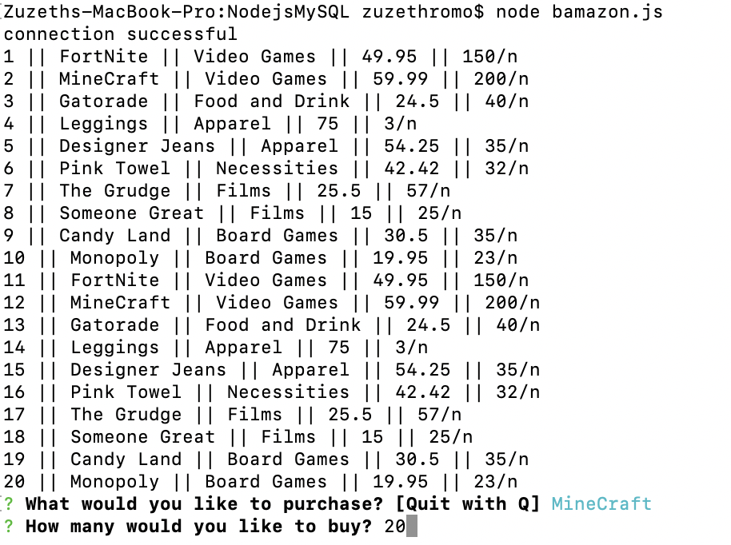

# NodejsMySQL

Nodejs & MySQL! 

    An app using MySQL to enter product, pricing, and quantity while using Node to run the app to buy the products. 

- Starting from the terminal (already on the file path)

- Enter node bamazon.js
    - Options for products, pricing, and quantity will appear
    - Option to Quit will appear
    

- If Q is pressed then app Quits

- To select a product type in product name 

- Type in quantity

- A message will say product bought, which is successful

- The quantity from the product is then deducted and gives the option to choose another product and quantity
